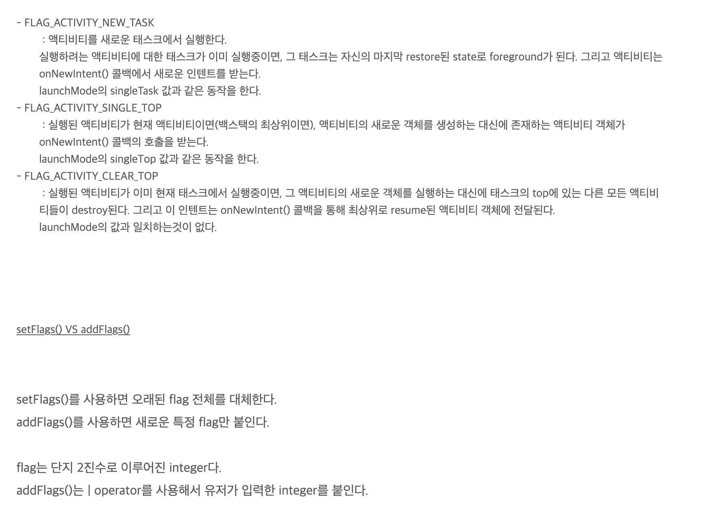

# Android


1. 과정 목적

- 안드로이드를 구성하고 있는 주요 component

Activity Service Broadcast Receiver Content Provider


## Android의 정의

=> 안드로이드 안에는 OS(Linux Kernel) + 미들웨어 + 핵심 어플리케이션(ex: 전화, 갤러리, 카메라, 브라우저,..)

​     이런것들이 포함되어 있는 모바일 디바이스를 위한 소프트웨어 스택(계층구조로 쌓여있음) 

​	 하단에는 OS -> 미들웨어 -> 프레임워크 -> 어플리케이션


## Android의 특징

=> 오픈 소스 : 안드로이드 소스코드가 모든 개발자에게 개방

=> 자바언어로 개발 : 자바언오아 코틀린 언어로 개발

=> 앱간의 자유로운 연동

=> ART Runtime 이 탑재되어 사용함. 성능 좋음:+1:


## Android가 빠르게 시장점유율을 높이는 이유

=> 오픈 소스

=> Eco System 이 잘 되어있어요! (서로간의 시스템이 잘 연결되어있어서  서로의 이익을 창출)


## Android는 Framework

- Library vs Framework
- 라이브러리는 특정 기능을 쉽고 편하게 구현할 수 있다.  => 프로그램을 쉽게 만들어줌. (ex: json 을 쓰기위한 잭슨 라이브러리?) 하지만 결과적으로 유지보수가 어렵다.
- Framework 을 이해해야지 뭔가 만들 수 있음. 이 자체가 시간이 많이듬. 하지만 체계적인 틀이 잡혀있어서 유지보수가 편함. 

=> 안드로이드는 프레임워크들로 구성되어있는 플랫폼이다 그러니!! 프레임워크에 대한 제대로된 이해가 필요하다!


## Android를 구성하는 Component

4가지 주요 Component에 대해서 알아야한다!

1. Activity : Android App의 화면 1개, UI를 담당하는 Component, 사용자의 Event 처리를 담당 (오래걸리는 로직이나 과부화가 일어날수 있는 것들은 여기서 처리하면 안된다.)

   [Activity Lifecycle](https://starryz.tistory.com/2?category=853011)

   

2. Service : 내부 로직처리를 담당. 데이터베이스 연결, 네트워크 연결 처리, 사용자와의 interaction 은 담당하지 않는다. 일반적으로 background 에서 로직처리를 담당한다.

3. Broadcast Recevier : 안드로이드 시스템에서 발생되는 여러가지 broadcast(신호)를 받아서 적절한 처리를 하는 componet ex: 배터리가 없다는 신호를 잡아서 화면에 보여줘!의 신호를 송신함.

4. Content Provider & Resolver : 모든 안드로이드 앱은 SandBox Mode(하나의 앱이 독립적으로 사용됨.즉 다른앱이 나의 데이터에 들어오거나 할수 없는 것들l 을 이용. 한 앱이 사용하고 있는 데이터를 다른 앱으로 데이터 공유가 가능케하는것. 


## Android

Package를 유니크하게 만든다.


Service 의 Exported : 다른앱에서 이 서비스를 사용할수 있는지? 아니면 나만 쓸건지

Enabled = 서비스 사용 가능성 여부


Service 는 의도치 않게 종료되었을 떄 백단에서 혼자서 살아나서 일할수 있다. Activity 는 꺼버리면 불가능.

## Context

진짜 계속해서 봐도 이 context 개념이 머리에 잡히질 않는다.. 보다가 잘 정리된다면 수정 예정이다. 

[링크](https://starryz.tistory.com/4?category=853011) <- 제일 잘 정리되어있는 것 같다. 잘 모르겠으면 차근차근 한번씩 더 봐보자.

Context는 '상태' 라는 말과 제일 가까운 것 같다.


## Flag
- 안드로이드에서 자주 쓰는 플래그 세 개와 addFlag와 SetFlag의 차이점! [출처](https://stickyny.tistory.com/109)




## ViewModel

안드로이드에서 ViewModel을 왜 사용할까?? Acitivity 나 Fragement 의 생명주기를 안드로이드 Framework 가 관리하기 때문에 어떤 요청에 의해서 UI 를 지우고 다시  생성하는 것은 개발자가 관리하기 힘들어지는 현상이 발생한다. 이 상황에서 UI controller 를 destory 하고 다시 생성하는 것은 UI와 관련되어져 있는 데이터가 사라진다는 것을 의미한다. 간단한 데이터 같은 경우 `onSaveInstanceState()` 메소드로 데이터를 복귀하고 다시 `onCreate()` 에서 호출될 수 있겠지만 사진이나 유저의 목록등 대용량의 데이터들을 처리하는데는 적합하지 않을 것이다.

다른 문제로는 UI controller는 종종 응답을 받기 위해 시간이 걸리는 작업들을 비동기적으로 처리한다. UI controller는 이런 비동기 호출들을 관리해야하고 잠재적 메모리 누수를 피하기 위해서 시스템에서 작업이 끝나고 작업들을 정리하는지 확인해야 한다. 이런 관리에는 많은 유지보수가 필요하고 구성이 변경 됐을 때, 개체가 다시 생성되는 경우 실행되었던 호출을 반복적으로 할 수 있어 자원들이 낭비된다.

Activity 나 Fragment 는 주로 UI 데이터를 표시하거나 사용자의 작업에 반응, 권한 요청과 같은 운영체제와의 통신을 처리하기 위한 것으로 사용되어야 합니다. 이런 작업들을 우선으로 삼아야하기 때문에 UI 컨트롤러에서 Database 나 Network 요청을 할 시 클래스가 너무나도 커지게 되는 문제가 발생합니다. 단일 클래스가 많은 문제들을 혼자 처리하려고 한다면 효율성이 떨어지고 이렇게 구현시 후에 테스트가 훨씬 더 어려워질 것입니다.

그래서 UI controller 와 View 가 가진 data들을 분리하는 방법이 훨씬 더 쉽고 효율적으로 작용합니다. 그래서 ViewModel을 사용하는 것입니다!


## Room

[링크](https://tourspace.tistory.com/28?category=788397)


```
<?xml version="1.0" encoding="utf-8"?>
<androidx.constraintlayout.widget.ConstraintLayout xmlns:android="http://schemas.android.com/apk/res/android"
    xmlns:app="http://schemas.android.com/apk/res-auto"
    android:layout_width="match_parent"
    android:layout_height="100dp"
    xmlns:tools="http://schemas.android.com/tools">

    <ImageView
        android:id="@+id/product_img"
        android:layout_width="0dp"
        android:layout_height="0dp"
        app:layout_constraintWidth_percent="0.2"
        app:layout_constraintHeight_percent="0.7"
        app:layout_constraintBottom_toBottomOf="parent"
        app:layout_constraintLeft_toLeftOf="parent"
        app:layout_constraintTop_toTopOf="parent"
        app:layout_constraintRight_toRightOf="@id/item_vertical_gl"/>

    <TextView
        android:id="@+id/product_title"
        android:layout_width="0dp"
        android:layout_height="wrap_content"
        tools:text="상품 이름이 들어갈 공간입니다."
        android:textColor="@android:color/black"
        app:layout_constraintWidth_percent="0.7"
        app:layout_constraintTop_toTopOf="parent"
        app:layout_constraintBottom_toTopOf="@id/product_count"
        app:layout_constraintLeft_toRightOf="@id/item_vertical_gl"/>

    <TextView
        android:id="@+id/product_count"
        android:layout_width="wrap_content"
        android:layout_height="wrap_content"
        tools:text="수량"
        app:layout_constraintTop_toBottomOf="@id/product_title"
        app:layout_constraintBottom_toTopOf="@id/proudct_price"
        app:layout_constraintLeft_toRightOf="@id/item_vertical_gl"/>

    <TextView
        android:id="@+id/proudct_price"
        android:layout_width="wrap_content"
        android:layout_height="wrap_content"
        tools:text="상품 가격"
        app:layout_constraintTop_toBottomOf="@id/product_count"
        app:layout_constraintLeft_toRightOf="@id/item_vertical_gl"
        app:layout_constraintBottom_toBottomOf="parent"/>

    <Button
        android:layout_width="60dp"
        android:layout_height="40dp"
        android:layout_marginEnd="16dp"
        android:layout_marginRight="16dp"
        android:text="삭제"
        android:textSize="10sp"
        app:layout_constraintBottom_toBottomOf="parent"
        app:layout_constraintEnd_toEndOf="parent" />

    <androidx.constraintlayout.widget.Guideline
        android:id="@+id/item_vertical_gl"
        android:layout_width="wrap_content"
        android:layout_height="wrap_content"
        android:orientation="vertical"
        app:layout_constraintGuide_percent="0.3" />


</androidx.constraintlayout.widget.ConstraintLayout>
```