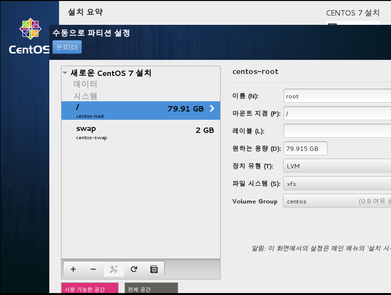
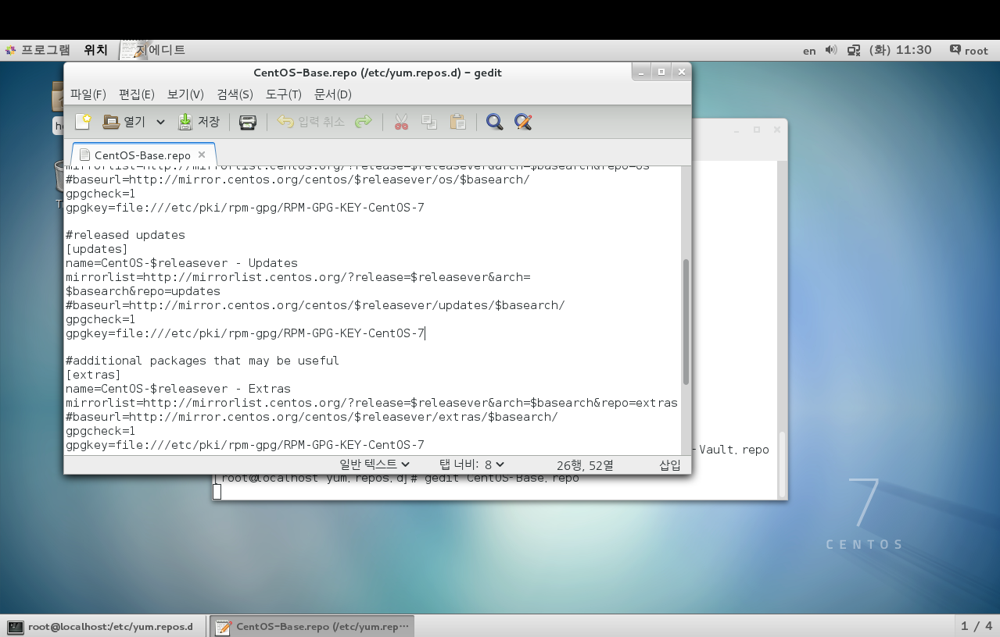
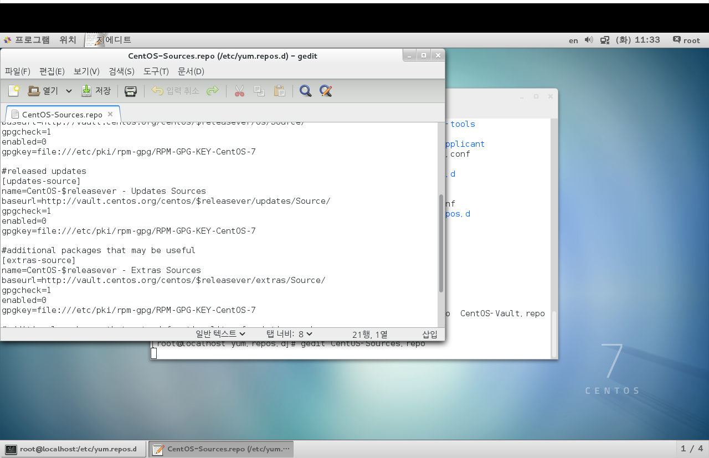
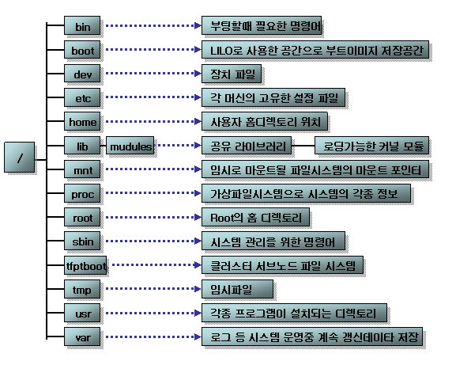

# Linux

- 리눅스 명령어는 타이핑하여 입력하는 환경 제공 CMD

배우는 이유: Hadoop 이해하고 실행 하기위해

하둡을 배우는 이유: 빅데이터 저장 / 처리하기 위해


-물리적으로 1대의 컴퓨터에서 여러대의 컴퓨터를 이용하는것과 같음

서버용 하드디스크는

SCSI 스캇


아이피 

c\hadoop\vm1 ===> 192.168.111.xxxx

+windows ===> 192.168.111.xxxx

앞에 세자리를 똑같이 맞춰줘야 그룹으로 이해하고 통신이 가능하다

===> 2대 컴퓨터가 통신 하려면 ipconfig 안에 vmnet8 이 있는지 확인해야한다. VMnet 을 사용하기위해서


안의 vmware 안에 vmnetcfg.exe 파일을 넣고 작업을 해주었다. 책에서 하는것 처럼 하면 안된다고 하니 개인적으로 찾아보거나 선생님께 질문을 요청.



파티션을 나눈것

swap 은 여유

/는 나머지


리눅스 명령어

update부분 주석 처리하기



여기 update도 주석


windows : 폴더라는 개념이있음

linux : 디렉토리라고 부름.


cd : 위치 이동

ls: 디렉토리에 뭐가있니?

wget : 다운로드

yum : 다운로드 + 설치(/etc/)

gedit : 

pwd: 현재의 디렉토리가 어디인가

/ : filesystem 에서의 root

/root : root 계정 관련 저장 디렉토리

/home/사용자계정 : 해당 사용자 계정 관련 저장 디렉토리

/etc/... : 설정파일을 저장하는 디렉토리

/usr/... : 모든 계정이 사용할 수 있는 디렉토리


ls 파일명 ==> 파일 정보 확인

cat 파일명 ==> 파일 내용 출력(입력 x)

gedit 파일명 ===> 파일 내용 출력(입력 o 이게 편하다.)

vi 파일명 ==> 파일 내용 출력(입력 o 하지만 윈도우에 친숙한 우리는 불편)


man ls ==> ls 에 대한 설명들이 나온다. 즉, 앞에 man => manual 의 약어로 도움말!


## 리눅스의 디렉토리



- 종료 명령어
  - shutdown -P now : 지금 바로 종료.
  - shutdown -P +10 : 10분 뒤 종료
  - halt -p
  - init 0 
  - poweroff


- 재시작 명령어
  - shutdown -r now 
  - reboot 
  - init 6 (0~6)


vm1 : NAT: VMNET8 : VM 컴퓨터 + 호스트 컴퓨터들 안에서만 네트워크가 가능함. 

192.168.111.XXX 내부적으로 통신할때 필요


```cmd
[root@loaclhost ~]# ==> #이면 root
[centos@localhost ~]$ ==> $이면 유저
whoami 명령어로 확인가능.

[root@loaclhost ~]# su - [유저명] ==> 계정바꾸기 가능.
[centos@localhost ~]$ exit => 다시 root 로 돌아오기 가능.
```

> 유저를 변경할 때 root 계정이면 비밀번호 없이 유저변경이 가능하다.


## 파일 허가권

chmod 000 파일명 허가권을 이렇게 설정한다.

파일 디렉토리 사용 권한 부여

사용 권한 3가지 파일마다 다르게 적용

r: read

w : write

x: execute 

소유자 / 그룹 / 그외 사용자

rwx/rwx/rwx

리눅스에서는

rwxrw-rw- 이런식으로 쓰여진다. 즉 소유자는 읽기,쓰기,실행이 가능하고 같은 그룹은 rw만 가능, 그외사용자는 rw만 가능하다는 소리다.


RMX

0: 3개 다 불가능


## 리눅스 설치 파일

- rpm 

  *.rpm 파일 설치 /삭제 설치정보확인

  rpm -Uvh *.rpm : 설치

  ==> U : 없으면 설치 있으면 업그레이드 // v : 설치 과정 출력 // h:####설치하는 과정을 보여줘!

  rpm -e * : 삭제

  rpm -qa jdk* : 설치 프로그램 조회

  rpm -qip *.rpm  : 미설치 프로그램 정보 조회


- yum
  1.  의존성 파일 자동 같이 설치
  2. rpm 명령 설치파일 미리 내 컴퓨터 다운로드 되어 있어야 사용가능
  3. 다운로드 + 설치

> 시작하기전에 gedit /etc/yum.repos.d/CentOS-Base.repo 여기에 있는 base를 잘 확인하자 여기에서 먼저 다운로드 받을 수 있는 파일 목록을 저장한 url 이 들어있다.


## 리눅스 파일 찾기

- which : 환경변수 등록 경로상 파일명
- whereis : 
- <span style="color:red">find /root-name jdk*</span> 
- rpm -qa [rpm 파일명]


리눅스 jdk 설치

1. 리눅스 설치시 openjdk 1.7 이 자동적으로 설치되어있다.
2. 먼저 삭제하고 
3. 새로운 버전을 설치해보자!
4. 환경 변수 path 등록
5. hadoop java