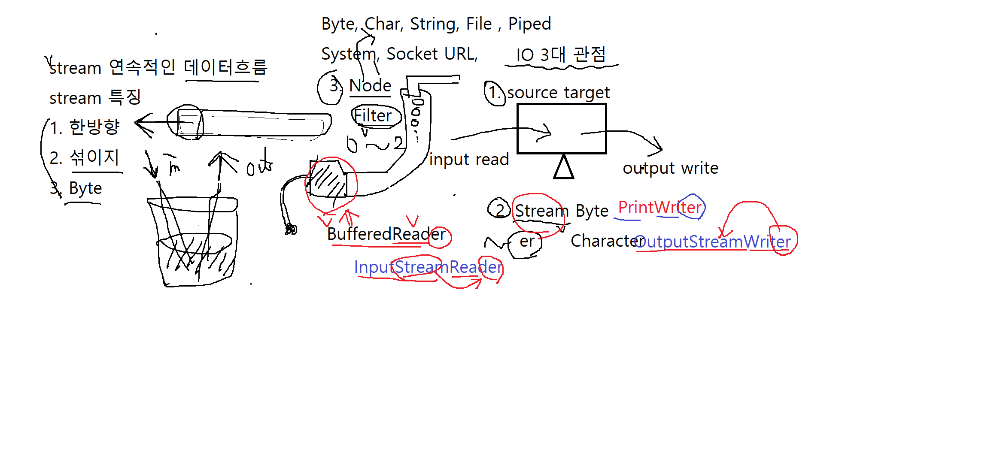

# 08/03

Java에서의 메모리 동적할당 => `new` 생성자 호출


배열의 인덱스가 0부터 시작하는 이유 => offset 이라고 생각하면 편함. 메모리가 0부터 얼마나 떨어져있나로 이해하면 편함.


## 트리

- 비선형 구조
- 원소들 간에 1:N 관계를 가지는 자료구조
- 원소들 간에 계층관계를 가지는 계층형 자료구조
- 상위 원소에서 하위 원소로 내려가면서 확장되는 트리(나무) 모양의 구조

##### 차수(degree)

- 노드의 차수 : 노드에 연결된 자식의 수
- 트리의 차수 : 트리에 있는 노드의 차수 중에서 가장 큰 값
- 단말 노드: 차수가 0인 노드, 자식 노드가 없는 노드


##### 높이

- 노드의 높이: 루트에서 노드에 이르는 간선의 수. 노드의 레벨
- 트리의 높이: 트리에 있는 노드의 높이 중에서 가장 큰 값. 최대 레벨


#### 이진 트리

모든 노드들이 최대 2개의 서브트리를 갖는 특별한 형태의 트리

각 노드가 자식 노드를 최대한 2개 까지만, 왼쪽 자식 노드, 오른쪽 자식 노드


# 08/04

## 그래프

그래프는 아이템(사물 또는 추상적 개념)들과 이들 사이의 연결 관계를 표현한다.


- 유향 그래프(방향성이 있는 그래프)
- 무향 그래프(방향성이 없이 양방향으로 왔다갔다 할 수 있는 그래프)


트리는 싸이클이 없는 무향 연결 그래프이다.


# 08/06

최소 신장 트리: N개의 정점이 있으면 N-1 개의 간선으로 고립된 정점이 없이 연결되어있는 트리


Java에서의 정렬

Comparable

int compareTo(T other)

- 음수결과 : 타 원소가 크다

- 0 결과 : 둘이 같다.
- 양수 결과 : 자신이 크다.

기본적으로 오름 차순 으로 정렬하기 때문에 결과값이 음수면 그대로, 양수면 둘의 자리를 바꾼다.


## 그리디 알고리즘

상황에서 최선의 선택을 이어나가 마지막에도 최적을 만드는 것.

하지만 언제나 최선의 선택인것 같지만 마지막에 최적을 이루지 않는 경우도 있다는 것을 명심해야한다.


# 08/10

다형성

하나의 이름으로 여러 개의 현태를 구성할 수 있는 OOP 특징을 다형성

Type 과 methods 로 크게 나뉘어서 생각

우선 method 에서의 다형성

overloading 과 overriding


overloading - 이름이 같아도, paramter가 다르면 별개의 method로 간주함. 생성자도 동일

overriding - 상속 관계에서 부모 Class의 method를 자식 Class에서 재정의 할 수 있음.


추상성(Abstract)

구현된 내용을 몰라도 돌아가는것.


java 의 Exception - runtime, checked(compile)


iterator => 컬렉션의 레퍼런스를 가져와서 하나씩 조회하면서 객체에 접근한다.


HashSet은 두 객체의 중복 여부를 체크할때 List 계열보다 엄격 Object 클래스는 hashCode()를 이용하여 그 값이 같은 경우 같은 객체로 인식한다.


## 8/12

File Class => 물리적인 file과 folder를 모두 표현한다.

OS 마다 다른 경로 구분자로 File.Separaotr를 제공하여 OS 독립적인 코드 구성할 수 있다


Exception의 최상위는 throwable


에러와 예외는 다르다. 에러는 프로그램적으로 처리 불가한 것들 예외는 충분히 예상할 수 있는 것들.

Compile 과 Runtime 계열의 예외들


IO의 3대 관점


1. source target (input 이나 output 이냐)

2. Stream Byte (~er의 캐릭터 타입이냐 byte 타입이냐) 대부분 Stream으로 끝나거나 er로 끝난다.

3. Node Filter

   Node - character byte String file piped,System, Socket, URL

   나머지는 성능을 좋게해주는 필터들



## XML(eXtensible Markup Language)

Wellformed  언어

- case sensitive

- start & end : 여는 태그와 닫는 태그가 있다

- empty : \</student\> 이런식으로 사용가능하다.

- attribute \ 

- entity  컨텐트안에 사용 불가능한 문자가있다. (ex &)

  ```
  & : &amp; 
  < : &lt; 
  > : &gt; 
  ' : &apos; 
  " : &quot;
  ```

  이런식으로 사용해야한다.

-  nested 가 지켜져야한다. 한 태그가 열렸으면 그게 닫치기 전에 그 부모가 닫쳐서는 안된다.