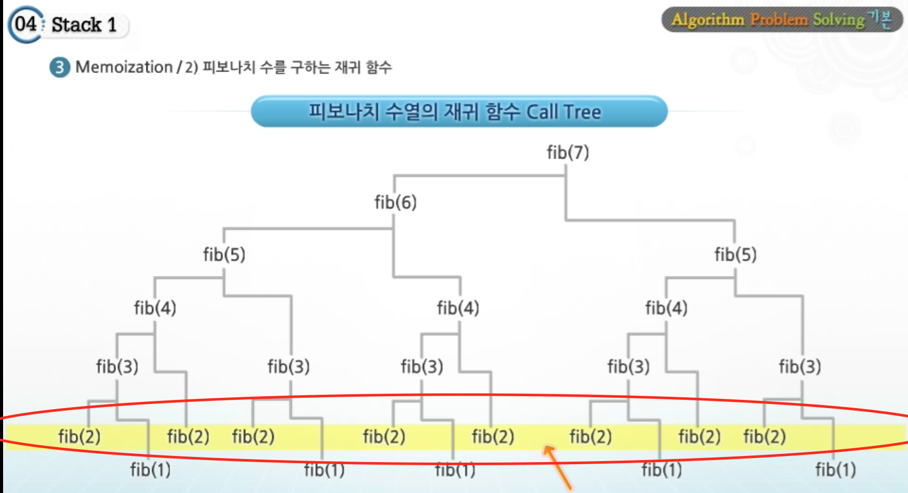
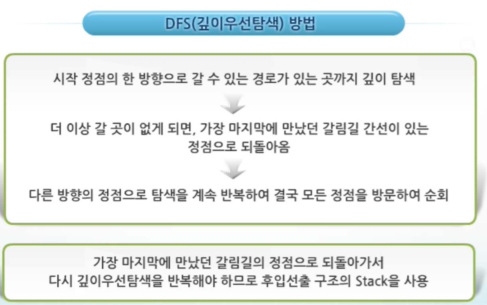

# Stack

## 1차시, 2차시

- 간단한 내용이라 생략
- LIFO 구조로 배열로 많이 구현을 하게 됨.

## 3차시

- 피보나치 수열을 Stack으로 구현해보자

```
fibo(n)
	if (n < 2) then
					return 1;
	else
					return fibo(n-1) + fibo(n-2);
end fibo(n)
```

=> 간단하게 구현 가능하지만 많은 문제점이 있다. 바로 엄청난 **중복 호출**!




이걸 해결하기 위해서 **Memoization** 기법을 활용해보자!

> Memoization 이란 프로그램을 실행할 때, 이전에 계산한 값을 메모리에 저장해 매번 다시 계산 하지 않도록 하게 하지 않게 하여 전체적인 실행 속도를 빠르게 만드는 법. DP(동적계획법) 에 핵심이 되는 기술이다.


```
fib1(n)
	if n >2 and memo[n] is zero then
		memo[n] <- fib1(n-1) + fib1(n-2);
	return memo[n]
end fib1()
```


## 4차시(동적계획법)

- DP (Dynamic Programming)이란?
  - 그리디 알고리즘 설계 기법과 같이 최적화 문제를 해결하는 알고리즘 설계기법
  - 먼저 입력 크기가 작은 부분 문제들을 모두 해결 => 그 해들을 이용하여 큰 크기의 부분문제들을 해결
  - 최종적으로 원래 주어진 입력의 문제를 해결한다!


=> 피보나치 함수를 구하는 것에 DP를 적용해보자!

```
fib2(n)
	f[0] <- 0;
	f[1] <- 1;
	
	for(i <-2; i<=n; i<- i + 1) do
		f[i] <- f[i-1] + f[i-2];
	return f[n];
	
end fib2(n)
```


- DP 의 구현 방식 2가지
  - recursive 방식(재귀호출) : 위에 있는 fib1() 이다. 재귀적 구조는 내부에 시스템 호출 stack 을 사용하는 **overhead**가 발생할 수 있다.
  - iterative 방식(반복문) :  fib2() 방식 Memoization을 재귀적 구조에 사용하는 것 보다 반복적 구조로 DP를 구현한 것이 **성능면에서 보다 효율적**이다.


## 5차시(DFS)

